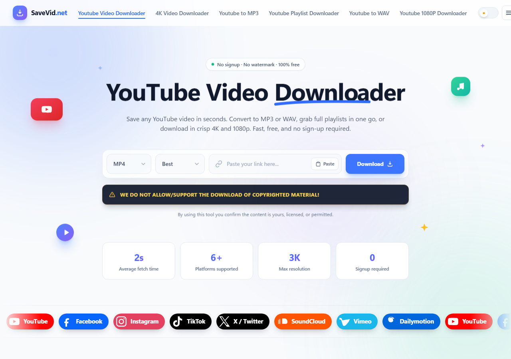
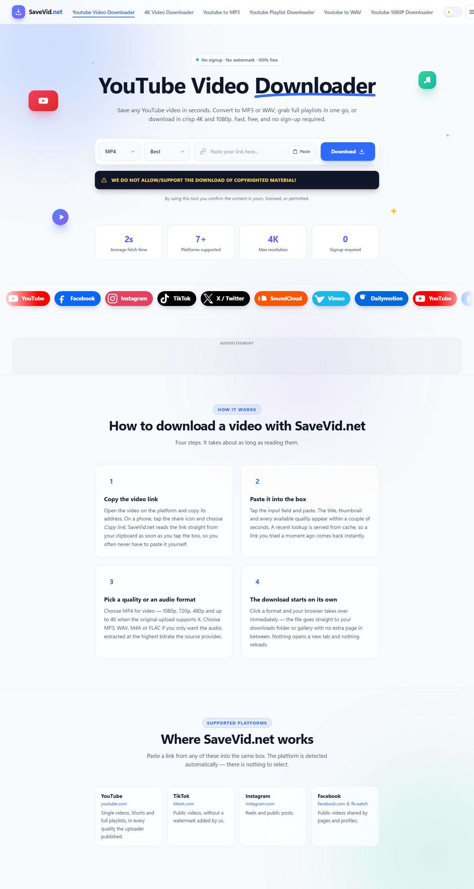
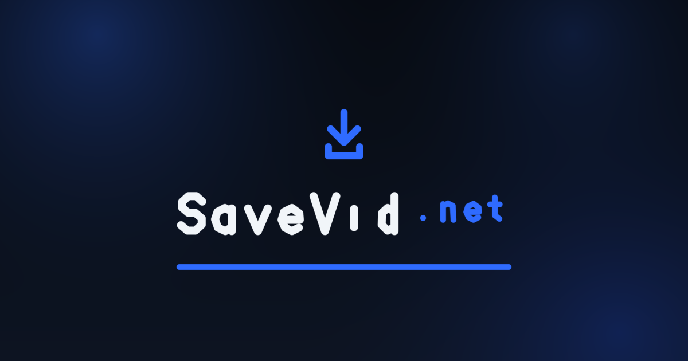

<div align="center">


# SaveVid.net

**Paste a link. Get the file. Two seconds, no signup, no watermark.**

[](https://savevid-sigma.vercel.app)
[](LICENSE)
[](#design-notes)

</div>

---

**🌐 Live site → [savevid-sigma.vercel.app](https://savevid-sigma.vercel.app)**

SaveVid.net is a video downloader for YouTube and seven more platforms. Paste a
link, pick a format, and the file lands straight in your downloads folder — no
account, no watermark, no waiting on a queue.



## What it does

- **8 platforms** — YouTube, TikTok, Instagram, Facebook, X, SoundCloud, Vimeo
  and Dailymotion. The platform is detected from the link; there is nothing to
  select.
- **Up to 4K, plus audio** — MP4 for video, or MP3 / WAV / M4A / FLAC for audio
  extracted at the source's highest bitrate.
- **Playlists in one go** — grab a full YouTube playlist without picking each
  video out by hand.
- **Installable** — works as a PWA on phone and desktop, and as a Chrome
  extension, so the downloader sits one click from any video page.
- **No signup, ever** — nothing to create, nothing to verify, no email.

## Screenshots

| | |
| --- | --- |
|  |  |

## The stack

Deliberately boring, and small enough to read in one sitting.

| Layer | What it is |
| --- | --- |
| Frontend | Static HTML, CSS and vanilla JS. No framework, no build step. |
| Backend | Node's built-in `node:http` and `fetch`. **Zero runtime dependencies.** |
| Hosting | Vercel — one serverless function, everything routed through it. |
| Also included | A PWA service worker, a Chrome MV3 extension, and an Electron desktop app. |

There is no `package.json` install step to run before the site works. Clone it
and start the server.

## Running it locally

```bash
node server.js          # http://localhost:8899
PORT=3000 node server.js
```

That's the whole setup. `server.js` opens a listener only when it is run
directly, so `require`-ing it never binds a port — which is what lets the
Vercel function mount the exact same handler without a second copy drifting out
of sync.

## Deploying

The site is a Vercel project: **https://savevid-sigma.vercel.app**

```bash
vercel --prod --yes --name savevid
```

`--name` is not optional here. Without it the CLI derives the project name from
the folder path, which contains spaces and capitals, and Vercel rejects it.

Two things in [vercel.json](vercel.json) are load-bearing:

- **Every non-`/api/` path rewrites into the function** (`/((?!api/).*)`). The
  site is served by the same handler that runs locally, so production cannot
  drift from development — and `robots.txt` and `sitemap.xml` are generated
  dynamically instead of going stale.
- **The static site goes through the function rather than the CDN on purpose.**
  The download relay at `/api/stream` has to set `Content-Disposition` so the
  browser names the saved file, and a Vercel rewrite strips that header.

`WEB_ROOT` is set in [api/index.js](api/index.js) because `__dirname` is
`/var/task/api` there, not the project root — the one place in the codebase that
needs to know which host it is running on.

## What's in the repo

| Path | What it is |
| --- | --- |
| [`web/`](web/) | The site. Static HTML/CSS/JS, installable as a PWA. |
| [`web/index.html`](web/index.html) | The downloader page. |
| [`server.js`](server.js) | Backend: static serving, rate limiting, the `/api` routes, the media relay. |
| [`api/index.js`](api/index.js) | Vercel entry point. Mounts the same handler. |
| [`vercel.json`](vercel.json) | Routing, cache headers, security headers. |
| [`extension/`](extension/) | Chrome MV3 extension — `chrome.downloads` from any video page. |
| `main.js`, `preload.js`, `ai.js`, `renderer/`, `resources/` | The Electron desktop app. |

## Design notes

A few decisions that are load-bearing, and the reasoning behind them:

- **Zero runtime dependencies.** The backend uses only Node built-ins. On a
  server that fetches URLs handed to it by strangers, there is no install step
  and no supply chain to audit.
- **`sw.js` and `manifest.webmanifest` are never cached**, at any layer. A long
  `max-age` on a service worker pins every visitor to whichever version their
  browser first fetched — a fix on the server would never reach anyone.
- **`/api/` is never cached by the service worker.** Download responses are
  large, unique and one-shot.
- **The relay is throttled on purpose.** A misconfigured or hostile client
  should not be able to use the site as a bandwidth proxy, so downloads are
  rate-limited per IP.
- **The site is honest about what it is.** Every legal page is a real,
  crawlable page rather than a template, and the downloader carries a visible
  copyright notice — the tool only helps with media you have the right to save.

## Legal

Privacy Policy, Terms of Service, DMCA and About/Contact all live in
[`web/`](web/) as real pages, cross-linked from every footer. A sister site by
the same operator: [AIFinancePK](https://aifinancepk.site).

This project is released under the MIT License.
